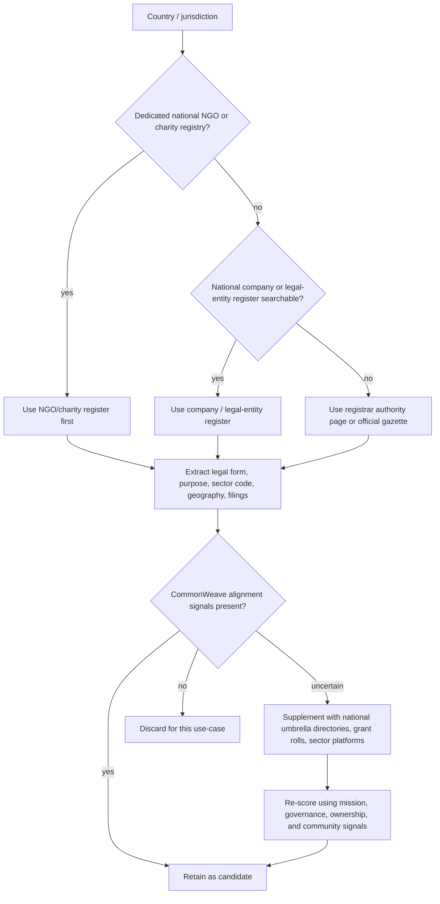

# Global Seed Inventory of Country-Level Registries for Commonweave-Aligned Organizations

## Executive Summary

I treated the CommonWeave README as a **purpose / governance / legal-form screen**, not as a requirement that an organization carry any official label. In practice, that means the most useful country-level discovery sources are usually the databases that expose some combination of **legal form, public-benefit or nonprofit status, business purpose or object clause, sector/activity code, filings, directors, shareholders, and geographic footprint**. Where a country has a dedicated charity, NGO, or nonprofit registry, that source is often best for alignment work. Where it does not, the national company or legal-entity register is usually the best starting point, especially if it includes cooperatives, associations, companies limited by guarantee, community-interest entities, or searchable purpose text. citeturn0view0turn13view0turn18view0turn34search0turn31search3turn25search3turn26search4

Across the sources I checked, the strongest pattern is that **formal legal-entity data are far easier to retrieve than informal or unregistered civic groups**. Several official systems explicitly cover nonprofit or community entities—such as Palau’s corporations registry, Dominica’s CIPO, Antigua and Barbuda’s ABIPCO, and Solomon Islands Company Haus—but even those still center registered entities. Informal mutual-aid groups, pop-up community energy groups, neighborhood commons projects, and many volunteer collectives are usually absent from official registries and need supplemental discovery through umbrella directories, ministry program lists, local grant rolls, or reputable unofficial national directories. citeturn34search0turn34search2turn25search3turn26search4turn31search3turn31search2

A second pattern is that **machine-readability varies sharply**. Some registries behave like modern searchable databases or quasi-real-time systems—Palau says its new online system allows real-time searches, and Solomon Islands says company details are updated online in real time—while other registries are explicitly periodic, login-gated, paywalled, or operationally searchable only through name search, PDF extracts, or ministry counter services. Antigua’s public search page warns that its internet-search database is updated only periodically and is not a substitute for the official record. citeturn34search0turn34search1turn31search2turn26search4

Because the query asked for every country but accuracy matters more than pretending confidence, the inventory below is presented as a **high-confidence global seed list**. To keep it readable inside chat, I collapse countries that share the same registry architecture into cluster rows. Where I could not confidently verify a distinct public search portal, I mark the row as **authority page / public search not confidently verified** rather than guessing. The inventory prioritizes official registries first and uses reputable unofficial directories only where they materially improve discovery. The source families I relied on most were the official overseas-registry list published by entity["organization","Companies House","uk company registrar"], the broad official-register survey on Wikipedia, the registry catalog from entity["organization","Molfar Intelligence Institute","osint training org"], and direct checks of national portals such as Algeria’s CNRC/Sidjilcom, Angola’s GUE, Botswana’s CIPA, Brunei’s ROCBN portal, Fiji’s businessNOW, Palau’s FIC registry, Solomon Islands Company Haus, Dominica’s CIPO, and Antigua’s ABIPCO. citeturn13view0turn3view0turn18view0turn23search1turn23search3turn30search6turn31search5turn33search3turn34search0turn31search3turn25search3turn26search4

## How the CommonWeave Criteria Map to Registry Fields

The most portable way to operationalize CommonWeave-style alignment is to map candidate organizations through five field families.

The first is **legal form**. Registries commonly expose company type, legal form, or registration class. These fields are the fastest way to spot cooperatives, nonprofit companies, associations, foundations, companies limited by guarantee, community companies, or other mission-embedded forms. Palau explicitly applies its corporations system to for-profit, nonprofit, and foreign corporations; Solomon Islands distinguishes private, public, community, and overseas companies; Dominica covers local companies, non-profit companies, business names, and international business companies; and Antigua’s search covers companies, business names, charities, and societies. citeturn34search0turn34search2turn31search1turn31search3turn25search3turn26search4

The second is **purpose text and activity classification**. A registry becomes much more useful for alignment screening when it exposes an object clause, business sector, NACE/ISIC/NAICS-like code, or descriptive purpose field. Algeria’s CNRC highlights activity nomenclature and social-account filings; Solomon Islands requires a business sector and, for community companies, a statement of community interest; Fiji’s businessNOW flow routes registration through the Registrar of Companies and into sector-specific compliance steps; and the UK’s Companies House search exposes filing histories, officers, accounts, and related returns that can be combined with SIC codes and officer data downstream. citeturn23search1turn23search7turn31search1turn31search8turn33search0turn20view3

The third is **governance and ownership**. Many aligned organizations are not identifiable from name alone, but become identifiable when governance features are exposed: directors, officers, shareholders, beneficial owners, or filing history. Botswana’s CIPA exposes company / business-name / role searches; Palau’s new registry says directors and shareholders are searchable; Denmark’s CVR is described as exposing beneficiary and management data; and the UK’s Companies House is the canonical public example of searchable officers and filings. citeturn30search8turn34search2turn19view0turn20view3

The fourth is **nonprofit / public-benefit status**. When a country has a national charity, NGO, or nonprofit register, it should usually be prioritized over the company register for CommonWeave-style discovery. In the sources checked here, the clearest official or quasi-official examples were the US IRS tax-exempt data, Israel’s nonprofit directory, and country systems where nonprofit forms are covered inside the main corporation registry. citeturn20view3turn19view1turn34search0turn25search3turn26search4

The fifth is **community and commons signals**. These are rarely direct registry fields. In practice, they are inferred from combinations such as cooperative legal form, community-company status, charitable objects, land or housing purpose, energy or agriculture activity codes, public grant or tender participation, open-source or commons language in the stated purpose, and repeated filing / officer overlap with local civic institutions. That means many of the best databases are not “alignment registries” per se; they are registries with enough structured fields to let you infer alignment. citeturn31search1turn31search2turn23search1turn20view3

## Methodology

I prioritized sources in this order: **official NGO or charity registries**, then **official company or legal-entity registries**, then **official tax-authority or ministry lists**, then **official cooperative or social-economy portals**, and finally **reputable unofficial national directories** where they materially added coverage or machine-readability. To accelerate country discovery without inventing URLs, I used official cross-country lists from Companies House, broad registry surveys, and registry-catalog resources, then checked current official portals directly for representative jurisdictions. citeturn13view0turn3view0turn18view0turn7search0turn7search1turn7search2

The search templates were localized by language family. English-language queries used terms like “company registry,” “charity register,” “NGO registry,” “cooperative register,” “business names,” and “nonprofit search.” Francophone searches used “registre du commerce,” “registre des associations,” “registre des fondations,” “coopératives,” “RCCM,” and “guichet unique.” Hispanophone searches used “registro mercantil,” “registro de asociaciones,” “fundaciones,” “cooperativas,” and “consulta RUC.” Lusophone searches used “registro comercial,” “cadastro,” “guiché único,” and “cooperativas.” For Arabic-, Russian-, and Chinese-language jurisdictions I prioritized the local register name where that was discoverable, then the governing ministry or official portal when a clean public search path was not. I also used transliterated entity names where that improved recall. This matters because many official sites expose the richest search interfaces only in the national language. citeturn23search1turn23search3turn30search2turn31search5turn34search26

For coding, I used three update-frequency labels. If the site explicitly described online or real-time updating, I marked that. If the site explicitly said it was updated periodically, I marked that. Otherwise I recorded **not stated** rather than guessing. The same rule applied to access restrictions: if a registry clearly offered public search but charged for documents or required login, I wrote that; otherwise I left the restriction as **unclear**. citeturn34search1turn31search2turn26search4

## Global Inventory

The table below is a **readable seed inventory**, not a full machine-readable dump. To keep the report usable in chat, I collapse countries that share one registry architecture. Every sovereign/state-like jurisdiction is covered either individually or inside a cluster row. Rows marked **authority page** are the places where I could identify the authoritative registrar or governing office but could not confidently verify a distinct public search portal from the sources reviewed. The table is distilled from the cited source families and the cited official portal checks above. citeturn13view0turn3view0turn18view0turn23search1turn23search3turn30search6turn31search5turn33search3turn34search0turn31search3turn25search3turn26search4

**Africa**

| Country or cluster | Selected database or registrar | URL | Core attributes | Alignment mapping notes |
|---|---|---|---|---|
| Algeria | CNRC / Sidjilcom | [portal](https://sidjilcom.cnrc.dz/) | FR/AR/EN; company; informal:no; portal; basic free, richer detail by subscription; maint: CNRC / Ministry of Commerce | Use activity nomenclature, legal form, solvency / social-account filing signals, and company-name search for coops / community-serving firms |
| Angola | Guiché Único da Empresa | [portal](https://gue.gov.ao/) | PT; company + sole trader + cooperative; informal:no; portal; upd:not stated; free navigation; maint: Ministry of Justice and Human Rights | Strong for formal coops and SMEs; use legal form plus business purpose; not suitable for informal groups |
| Botswana | Companies and Intellectual Property Authority | [portal](https://www.cipa.co.bw/home) | EN; company/business/IP; informal:no; portal; role search; upd:not stated; maint: CIPA | Helpful where director / role overlap matters; use company type, beneficial-ownership compliance, and filings |
| Egypt | Best available: official corporate / market infrastructure pages; public company-heavy | [MCSD](https://www.mcsd.com.eg/) | AR/EN; stronger on listed / supervised entities than grassroots groups; informal:no; portal; upd:not stated | Better for registered companies and boards than charities or informal groups |
| Ethiopia | Best available: Ministry of Trade business licensing / registration authority | authority page | AM/EN; company; informal:no; authority page; public search not confidently verified | Use official registration / license status where accessible; supplement heavily for civic groups |
| Ghana | Best available: Registrar-General / ORC family of sources | authority page | EN; company/business; informal:no; portal or authority page depending service | Use legal form and filings; supplement with NGO department lists when needed |
| Kenya | Business Registration Service via eCitizen | authority portal | EN/SW; company/business society; informal:no; portal/login | Use business type and society / charity registration where available |
| Liberia | Liberia Business Registry | authority portal | EN; company/business; informal:no; portal | Use company status and legal form; informal groups absent |
| Madagascar | EDBM / one-stop business registration | authority portal | FR/MG; company; informal:no; portal | Useful for formal SMEs and coops; limited civic / nonprofit depth |
| Mauritius | Corporate and Business Registration Department | authority portal | EN/FR; company/business; informal:no; portal | Use legal form, annual return status, and registered office |
| Morocco | OMPIC / Registre Central du Commerce | authority portal | FR/AR; company; informal:no; search available; some paid history; maint: OMPIC | Good for legal form and commerce search; use sector + trade purpose text |
| Namibia | Business and Intellectual Property Authority | authority portal | EN; company/business/IP; informal:no; portal | Use legal form, status, and entity class |
| Nigeria | Corporate Affairs Commission | [portal](https://new.cac.gov.ng/home) | EN; company/association/business name; informal:no; portal; upd:not stated | One of the better African anchors for formal nonprofits and companies; use registration type and object clause where exposed |
| Rwanda | Rwanda Development Board company search | authority portal | EN/FR/KW; company; informal:no; portal | Useful for formal SMEs and social enterprises, less so for informal groups |
| Sierra Leone | Office of the Administrator and Registrar General | authority portal | EN; company/business/IP; informal:no; portal; search depth limited | Good for existence and registration status; less rich field coverage |
| South Africa | CIPC / BizPortal | authority portal | EN; company/business/license services; informal:no; portal/login | Strong for formal companies; use company type + filings; supplement with NPO Directorate for nonprofits |
| Tunisia | Registre National des Entreprises | authority portal | AR/FR; company + some nonprofit visibility; informal:no; portal/login | Use legal form and sector; stronger for formal entities |
| Uganda | Uganda Registration Services Bureau | authority portal | EN; company/business/NGO proximate services; informal:no; portal | Use business type and registrations; supplement with NGO Bureau when needed |
| Tanzania | BRELA | authority portal | EN/SW; company/business names; informal:no; portal | Strong for formal entities; use company type / business type |
| Zambia | PACRA search | [portal](https://search.pacra.org.zm) | EN; company/business names; informal:no; portal; free basic status/name/NACE/number | Use NACE + legal form + sector words to surface cooperatives / public-benefit firms |
| Zimbabwe | Deeds, Companies & Intellectual Property Department | authority page | EN; company; informal:no; authority page / gazette orientation | Stronger on formal company verification than mission filtering |
| OHADA / RCCM cluster: Benin, Burkina Faso, Cameroon, Central African Republic, Chad, Comoros, Congo (Rep.), Côte d’Ivoire, Gabon, Guinea, Mali, Niger, Senegal, Togo | National RCCM / guichet unique / business-creation portals | mixed national portals; start from justice / commerce / one-stop portals | FR; company/commercial registry; informal:no; portal quality varies from searchable to authority-page only; access varies | Shared pattern: use RCCM number, legal form, commerce activity, and object / filing text. For CommonWeave work, this family is good for coops, associations with commercial arms, and mission-led SMEs, but weak on informal groups |
| Lower-transparency / authority-first cluster: Burundi, Cabo Verde, Djibouti, Equatorial Guinea, Eritrea, Gambia, Guinea-Bissau, Lesotho, Libya, Malawi, Mauritania, Mozambique, São Tomé and Príncipe, Seychelles, Somalia, South Sudan, Sudan | Best available: registrar or ministry authority page; public search not confidently verified | authority page | Local language + EN/FR/PT mix; scope usually company/business; informal:no; access often offline / counter / PDF / notice-based | Treat these as authority anchors only. Use them to confirm legal existence, then supplement with country NGO umbrellas, grant lists, or social-economy networks |

**Americas and the Caribbean**

| Country or cluster | Selected database or registrar | URL | Core attributes | Alignment mapping notes |
|---|---|---|---|---|
| Antigua and Barbuda | Antigua and Barbuda Intellectual Property and Commerce Office | [search](https://abipco.gov.ag/searchtheregister/) | EN; company/business/charity/society; informal:no; portal; public search free; updated periodically; maint: ABIPCO | Excellent for a small-island jurisdiction because charities and societies are searchable alongside firms |
| Argentina | Best available national anchor: federal / provincial fragmentation; use national CSO and federal company entry points | authority-first | ES; NGO/company split; informal:no; national registry is fragmented | Best CommonWeave strategy is to pair federal CSO sources with provincial legal-entity registries |
| Bahamas | Registrar General’s Department | authority portal | EN; company/business; informal:no; portal or paid extracts | Better for formal company verification than alignment |
| Barbados | CAIPO | authority portal | EN; company/business/IP; informal:no; portal; corporate registry digitized | Use legal form and filings; supplement with charity / cooperative lists where needed |
| Belize | Belize Companies and Corporate Affairs / official or eData-style access | authority-first | EN; company; informal:no; public access partly commercialized | Good for formal company existence, weaker on civic mission |
| Bolivia | Fundempresa / Registro de Comercio | authority portal | ES; company; informal:no; portal | Use legal form and activity; supplement for associations / foundations |
| Brazil | Mapa das OSCs + Receita Federal CNPJ | national portals | PT; NGO/charity/company; informal:mostly no; portal/API-like data depending source | Very strong country for purpose-based discovery: use OSC tags, CNPJ status, legal nature, CNAE, and geography |
| Canada | Corporations Canada plus CRA charities list | federal portals | EN/FR; federal companies + charities; informal:no; national but incomplete because provinces matter | Pair charity status with federal corporation data; for coops and nonprofits, provincial harvesting is still necessary |
| Chile | Registro de Empresas y Sociedades / SII / commerce sources | authority portal | ES; company; informal:no; portal | Use company type and tax / registration status; supplement civil-society sources |
| Colombia | RUES | [portal](https://www.rues.org.co/) | ES; company/commercial registry; informal:no; portal | Good baseline for chambers / businesses and cooperatives; supplement when looking for NGOs |
| Costa Rica | Registro Nacional | authority portal | ES; company/legal entities; informal:no; search exists; access varies | Use legal form and tax / provider overlays |
| Cuba | National Office of Statistics registries / authority pages | authority-first | ES; company/state-enterprise orientation; informal:no | Better for formal/state-linked entities than autonomous civic groups |
| Dominica | Companies and Intellectual Property Office | [portal](https://www.cipo.gov.dm/) | EN; companies/business names/non-profit companies/IBCs; informal:no; portal; maint: CIPO | Very good for nonprofit-company detection because nonprofit companies are explicitly in scope |
| Dominican Republic | DGII taxpayer / entity search | authority portal | ES; taxpayers / companies; informal:no; portal | Strong for existence and tax status; weak for mission narratives |
| Ecuador | Tax and company-supervision portals | authority-first | ES; company / taxpayer; informal:no; portal | Use tax registration + company supervision records |
| El Salvador | Registro de Comercio / CNR family | authority portal | ES; company; informal:no; portal | Stronger on formal company presence than social mission |
| Guatemala | Registro Mercantil General | authority portal | ES; company/business; informal:no; portal | Use legal form + purpose + tax cross-checks |
| Guyana | Deeds and Commercial Registries Authority | authority portal | EN; company/business; informal:no; portal / authority page | Formal-existence anchor |
| Haiti | Best available: Ministry of Commerce / investment-formality authority | authority-first | FR/HT; company/business; informal:no; public search not confidently verified | Authority anchor only; supplement heavily |
| Honduras, Nicaragua | Best available: mercantile / tax authority entry points; public search confidence lower | authority-first | ES; company/business; informal:no; mixed portal quality | Use as formal-existence anchors, not complete discovery systems |
| Jamaica | Office of the Registrar of Companies | authority portal | EN; company/business; informal:no; portal | Basic but useful for legal-form filtering |
| Mexico | Federal CSO register / tax authority donor / company-register mix | authority-first | ES; NGO/company; informal:no; national ecosystem is fragmented | For CommonWeave work, prioritize OSC / authorized-donee sources for civic groups and RPC / SAT sources for formal entities |
| Panama | Registro Público de Panamá | authority portal | ES; company/legal entities; informal:no; portal; extracts paid | Strong for formal entities and foundations |
| Paraguay | RUC / tax-identification and public-procurement overlays | authority-first | ES; taxpayers / providers / legal entities; informal:no | Better for existence and compliance than mission narratives |
| Peru | SUNARP + SUNAT | authority portals | ES; company/legal entities/tax; informal:no; portal | Strong for formal legal-entity and tax status checks |
| Saint Kitts and Nevis | Split system: St Kitts legal / AG side + Nevis Companies Registry / FSRC-style systems | authority-first | EN; company; informal:no; federation is administratively split; public search fragmented | Use as best-available country anchor, but sub-jurisdiction harvesting is required |
| Saint Lucia | Registrar / international business company registry family | authority-first | EN; company/IBC; informal:no; public search depth limited | Formal-existence anchor |
| Saint Vincent and the Grenadines | Commerce / IP registry family | authority-first | EN; company/business/IP; informal:no; portal confidence lower | Formal-existence anchor; supplement for civic groups |
| Suriname | Chamber of Commerce and Industry | authority portal | NL; company; informal:no; portal | Good for legal-existence checks |
| Trinidad and Tobago | Companies Registry | authority portal | EN; company/business; informal:no; portal / counter services | Formal-existence anchor |
| United States | IRS tax-exempt search plus SEC and state business registries | [IRS](https://www.irs.gov) | EN; charity/NGO + public company + state-incorporation data; informal:no; search + bulk-data families | Best national-level source for aligned nonprofits is IRS tax-exempt data; for cooperatives, LLCs, and benefit firms, state registries remain necessary |
| Uruguay, Venezuela | Best available: tax / mercantile / ministry authority entry points; public search confidence lower | authority-first | ES; company/business; informal:no | Use as formal-existence anchors, not complete mission-discovery systems |

**Asia, the Middle East, and North Africa**

| Country or cluster | Selected database or registrar | URL | Core attributes | Alignment mapping notes |
|---|---|---|---|---|
| Afghanistan | ACBR / Ministry of Industry and Commerce | [license verification](https://moci.gov.af/index.php/en/license-verification) | DA/PS/EN; company/business licensing; informal:no; portal; public search limited; maint: MOCI / ACBR | Helps confirm formal registration and licenses; supplement with chamber / donor / NGO lists for civic groups |
| Armenia | State Register of Legal Entities | authority portal | HY/RU/EN; legal entities; informal:no; portal | Legal form and registration data are the primary filters |
| Azerbaijan | State Tax Service / e-taxes | authority portal | AZ/EN/RU; company; informal:no; portal | Useful for legal existence and company number |
| Bahrain | Sijilat / Business Information Gateway | authority portal | AR/EN; company/business; informal:no; portal | Better for formal firms than informal civic groups |
| Bangladesh | RJSC | authority portal | BN/EN; company/firm; informal:no; portal | Strong formal-company anchor |
| Bhutan | Office of the Registrar of Companies | authority-first | DZ/EN; company; informal:no; public search confidence lower | Use as authority anchor |
| Brunei | Registry of Companies and Business Names / OCP | [OCP](https://www.mofe.gov.bn/div_rocbn_corporateregistrysystem/) | EN/MS; company/business; informal:no; portal/login; maint: Ministry of Finance and Economy | Good for formal-company registration and name search |
| Cambodia | Ministry of Commerce business registration / gazette family | authority portal | KM/EN; company; informal:no; portal | Use legal form + business contacts + sector |
| China | National Enterprise Credit Information Publicity System | authority portal | ZH; company; informal:no; portal | Excellent for formal-entity existence, status, penalties, and legal-representative searches; weak on informal civic groups |
| Georgia | National Agency of Public Registry / business registry | authority portal | KA/EN; company/legal entities; informal:no; portal | Legal-form and history fields are useful |
| India | Ministry of Corporate Affairs | [portal](https://www.mca.gov.in) | EN; company/LLP; informal:no; portal; basic free, richer filings via paid / third-party layers | Use company class, CSR / section-8 status, object clauses, directors, and filings |
| Indonesia | Best available: AHU / OSS / ministry entity systems | authority-first | ID; company/legal entities; informal:no; portal | Use legal-entity type and business field; supplement for associations / foundations |
| Iran | Best available: national legal-entity / official-gazette family | authority-first | FA; company/legal entities; informal:no; portal exists but path not verified here | Use entity identifier + legal form + publication notices |
| Iraq | Companies Registration Department | authority-first | AR; company; informal:no; public search not confidently verified | Authority anchor only |
| Israel | Registrar of Companies plus GuideStar Israel | authority / directory mix | HE/EN; company + nonprofit; informal:no; portal | One of the better mixed ecosystems for aligned-org hunting because nonprofits have a dedicated searchable directory |
| Japan | Corporate Number Publication Site / NTA | authority portal | JA/EN; company/legal entities; informal:no; portal/API-like publication data | Strong for formal existence and legal-form/status matching |
| Jordan | Companies Control Department | authority portal | AR/EN; company; informal:no; portal | Useful for company status and type |
| Kazakhstan | Ministry of Finance / tax search | authority portal | KK/RU; company/IE; informal:no; portal | Strong basic existence/status data |
| Kuwait | Ministry of Commerce company-search family | authority-first | AR/EN; company; informal:no; portal confidence moderate | Formal-existence anchor |
| Kyrgyzstan | Ministry of Justice register | authority portal | KY/RU; company/legal entity; informal:no; portal | Good for legal-form filtering |
| Laos | Enterprise Registration / Ministry of Industry and Commerce | authority-first | LO; company; informal:no; public search confidence lower | Authority anchor |
| Lebanon | Commercial register authority / justice-commerce sites | authority-first | AR/FR; company; informal:no; public search confidence lower | Authority anchor |
| Malaysia | SSM e-Info | authority portal | MS/EN; company/business; informal:no; portal/login; paid details | Strong formal-company source |
| Maldives | Ministry of Economic Development business registry | authority-first | DV/EN; company/business; informal:no; portal | Formal-existence anchor |
| Mongolia | General Authority for State Registration | authority portal | MN; legal entities; informal:no; portal | Good for legal-form matching |
| Myanmar | DICA / MyCO | authority portal | MY/EN; company; informal:no; portal | Good for legal form and transportable entity status |
| Nepal | Office of Company Registrar | authority portal | NE/EN; company; informal:no; portal | Use exact-name matching and legal form |
| North Korea | No reliable public searchable national legal-entity registry identified | authority-first | KO; public search not found | Treat as opaque jurisdiction; rely on official notices and state-affiliated directories |
| Oman | business.gov.om / commerce registry services | authority portal | AR/EN; company; informal:no; portal | Good formal-company anchor |
| Pakistan | SECP name search | authority portal | EN/UR; company; informal:no; portal | Strong for formal-company detection |
| Palestine | Ministry of National Economy Companies Registry | authority portal | AR; company; informal:no; portal | Formal-company anchor |
| Philippines | SEC registry/search family | authority portal | EN/TL; company/non-stock corporation; informal:no; portal | Useful for non-stock / nonprofit corporate forms as well as firms |
| Qatar | Ministry of Commerce commercial registration | authority-first | AR/EN; company; informal:no; portal | Formal-company anchor |
| Saudi Arabia | Ministry of Commerce plus national nonprofit governance ecosystem | authority-first | AR/EN; company/nonprofit authority split; informal:no | Use company register for firms and dedicated nonprofit regulator directories for charities / associations |
| Singapore | ACRA BizFile | authority portal | EN; company/business; informal:no; portal/login; paid richer data | Strong formal-company source with clean identifiers |
| South Korea | Best available national anchor: court-corporate registry plus FSS DART for public co’s | authority-first | KO/EN mix; company; informal:no; public search fragmented | Use DART for listed entities and the court registry for broader formal verification |
| Sri Lanka | Registrar of Companies | authority portal | EN/SI/TA; company/business; informal:no; portal | Strong formal-company anchor |
| Syria | No reliable broad public corporate-search portal confidently verified here | authority-first | AR; authority / official notice orientation | Opaque / authority-first case |
| Taiwan | Department of Commerce search | authority portal | ZH/EN; company/business; informal:no; portal | Very useful formal-company anchor |
| Tajikistan | Tax Committee / Andoz | authority portal | TG/RU; company/IE; informal:no; portal | Basic legal existence/status |
| Thailand | Department of Business Development | authority portal | TH/EN; company/business; informal:no; portal | Strong formal-company anchor |
| Timor-Leste | SERVE / business verification family | authority-first | PT/TET; company/business; informal:no; portal confidence moderate | Formal-existence anchor |
| Turkey | MERSIS / trade-registry / chamber search mix | authority-first | TR; company/business; informal:no; portal | Use trade-registry type and chamber overlays |
| Turkmenistan | No reliable public searchable national legal-entity portal identified | authority-first | TK/RU; search not verified | Opaque / authority-first case |
| United Arab Emirates | Federal + emirate split; no single complete national company register confidently verified as universal | authority-first | AR/EN; company/license directories; informal:no; portal family is fragmented by emirate / free zone | Use emirate licenses, DIFC / DMCC / Abu Dhabi Business Center, and sector-specific public registers |
| Uzbekistan | State legal-entity / my.gov.uz family | authority-first | UZ/RU; company; informal:no; portal | Formal-company anchor |
| Vietnam | National Business Registration Portal | authority portal | VI/EN; company; informal:no; portal | Strong formal-company anchor |
| Yemen | Ministry of Industry and Trade / authority page | authority-first | AR; company; informal:no; public search not confidently verified | Authority anchor only |

**Europe**

| Country or cluster | Selected database or registrar | URL | Core attributes | Alignment mapping notes |
|---|---|---|---|---|
| Albania | National Business Center / QKB | authority portal | SQ/EN; company/business; informal:no; portal | Formal-company anchor |
| Andorra | Best available: government mercantile / companies service path varies | authority-first | CA/FR; company; informal:no; public search path not confidently verified | Use as authority anchor |
| Austria | Firmenbuch | authority portal | DE; company; informal:no; search usually via official / clearing-house interfaces | Strong company-law anchor |
| Belarus | Unified State Register of Legal Entities and Individual Entrepreneurs | authority-first | RU/BE; company/IE; informal:no; portal / extract request | Formal-existence anchor |
| Belgium | BCE / KBO | authority portal | NL/FR/DE/EN; company/legal entities; informal:no; portal | Strong for legal form and status |
| Bosnia and Herzegovina | Entity court-register system | authority-first | BS/HR/SR; company; informal:no; portal is entity-level | National work still requires entity-specific harvesting |
| Bulgaria | Commercial Register and Register of NPOs | authority portal | BG; company + NPO; informal:no; portal | Particularly valuable because the NPO register is integrated |
| Croatia | Court register / digital chamber family | authority portal | HR; company; informal:no; portal | Formal-company anchor |
| Cyprus | Department of Registrar of Companies and Official Receiver | authority portal | EL/EN; company; informal:no; portal/login for some documents | Good corporate anchor |
| Czech Republic | Public Register / ARES | authority portal | CS/EN; company/legal entities; informal:no; portal | Good for structured legal-entity and linked-register work |
| Denmark | CVR | authority portal | DA/EN; company/legal entities; informal:no; portal/API-like data culture; strong management / beneficial data | Excellent machine-readable baseline for alignment filtering |
| Estonia | e-Business Register | authority portal | ET/EN; company/NGO forms; informal:no; portal | Strong legal-form and filing anchor |
| Finland | YTJ / PRH | authority portal | FI/SV/EN; legal entities; informal:no; portal; some paid detail | Good for legal form and tax-debtor overlays |
| France | SIRENE / Annuaire des entreprises / legal-announcement family | authority-first | FR; company/legal entities; informal:no; portal/open-data family | Strong for industry codes and legal-form filtering |
| Germany | Unternehmensregister / Handelsregister | authority-first | DE/EN; company; informal:no; portal; some docs paid | Strong filings and legal-form anchor |
| Greece | GEMI / Official Gazette | authority-first | EL; company; informal:no; portal / gazette mix | Use registration and publication history |
| Hungary | e-Cégjegyzék / e-Beszámoló | authority-first | HU; company; informal:no; portal | Strong filings and accounts use-case |
| Iceland | Register of Enterprises / RSK | authority portal | IS/EN; company; informal:no; portal; some docs paid | Strong formal-company anchor |
| Ireland | Companies Registration Office plus RBO | authority-first | EN; company/beneficial ownership; informal:no; portal; some restrictions | Good governance and legal-form matching |
| Italy | Registro Imprese | authority portal | IT/EN partial; company; informal:no; portal; paid richer extracts | Strong formal-company anchor |
| Kosovo | Kosovo Business Registration Agency | authority-first | SQ/SR/EN; company/business; informal:no; portal | Formal-company anchor |
| Latvia | Register of Enterprises | authority portal | LV/EN; company/legal entities; informal:no; portal / login | Good for status and legal form |
| Liechtenstein | Land and Trade Registry | authority portal | DE; company; informal:no; portal/extract | Formal-company anchor |
| Lithuania | Centre of Registers / legal entities | authority-first | LT/EN; company/legal entities; informal:no; portal | Useful formal-entity anchor |
| Luxembourg | Luxembourg Business Registers | authority portal | FR/DE/EN; company/association; informal:no; portal/login; annual accounts visible after access | Strong for associations with formal legal status |
| Malta | Malta Business Registry | authority portal | EN/MT; company/legal entities; informal:no; portal; some paid detail | Good formal-company anchor |
| Moldova | State Register of Nonprofit Organizations plus legal-entity registry family | authority-first | RO/RU; NPO + legal entities; informal:no; portal | Better than many countries because nonprofit status is identifiable |
| Monaco | Registry of Commerce and Industry | authority-first | FR; company; informal:no; portal | Formal-company anchor |
| Montenegro | Central Registry / ePrijava family | authority-first | ME; company; informal:no; portal | Formal-company anchor |
| Netherlands | KvK | authority portal | NL/EN; company/legal entities; informal:no; portal; richer data paid | Strong formal-company anchor |
| North Macedonia | Central Registry (best available) | authority-first | MK; company; informal:no; portal | Formal-company anchor |
| Norway | Brønnøysund Register Centre | authority portal | NO/EN partial; company/legal entities; informal:no; portal | Strong formal-company anchor |
| Poland | KRS + CEIDG | authority-first | PL; company/associations/foundations + sole traders; informal:no; portal | Very valuable for alignment because associations / foundations are visible within KRS |
| Portugal | IRN / ePortugal business register family | authority-first | PT; company; informal:no; portal | Formal-company anchor |
| Romania | ONRC | authority-first | RO; company; informal:no; portal/login; some paid access | Formal-company anchor |
| Russia | EGRUL | authority portal | RU; company/legal entities; informal:no; portal | Strong formal-company anchor |
| San Marino | Registro imprese / archive of economic activities | authority-first | IT; company; informal:no; portal; auth / payment needed | Formal-company anchor |
| Serbia | APR | authority portal | SR/EN partial; company/legal entities; informal:no; portal | Good governance and shareholder screening |
| Slovakia | ORSR | authority portal | SK; company; informal:no; portal | Formal-company anchor |
| Slovenia | AJPES | authority portal | SL/EN partial; company; informal:no; portal/login for some features | Good formal-company anchor |
| Spain | Registro Mercantil Central / related registries | authority-first | ES; company; informal:no; portal/access restrictions vary | Good corporate anchor; use association/foundation registries in targeted sector work |
| Sweden | Bolagsverket | authority-first | SV/EN partial; company; informal:no; portal; richer docs paid | Strong company-law anchor |
| Switzerland | Zefix | authority portal | DE/FR/IT/EN; company/legal entities; informal:no; portal | Strong for legal-form and purpose screening |
| Ukraine | Unified State Register plus NGO register family | authority-first | UK; company/NGO; informal:no; portal family; some systems intermittently available | Valuable for legal entities and registered nonprofits |
| United Kingdom | Companies House | [portal](https://find-and-update.company-information.service.gov.uk) | EN; company/LLP/CIC; informal:no; portal/API/open-data family | One of the best global machine-readable anchors; use CIC / company type / SIC / officers / filings |
| Holy See / Vatican City | No clear public searchable national corporate register identified | authority-first | IT/LA; opaque / special-jurisdiction case | Authority-first only |

**Oceania and Pacific state-like jurisdictions**

| Country or cluster | Selected database or registrar | URL | Core attributes | Alignment mapping notes |
|---|---|---|---|---|
| Australia | ACNC Charity Register plus ABN / ASIC family | authority-first | EN; charity + company/business; informal:no; portal/APIs/bulk data across the ecosystem | One of the best countries for mission-first discovery because charities are nationally searchable |
| Fiji | businessNOW / Registrar of Companies | [portal](https://www.businessnow.gov.fj/) | EN; company/business-name registration; informal:no; portal; central business-start flow; maint: Fiji government | Strong starting-point registry, especially for formal SMEs and coops |
| Kiribati | Kiribati International Business and Companies Register | [portal](https://kiribas.net/) | EN; international/non-resident companies only; informal:no; portal | Useful for offshore / international entities; domestic-market entities need separate local discovery |
| Marshall Islands | IRI / maritime and corporate administrator family | authority-first | EN; company / maritime-heavy; informal:no; portal | Better for formal offshore entities than local civic groups |
| Federated States of Micronesia | Registrar of Corporations | [portal](https://www.roc.doj.gov.fm/index.php) | EN; company/corporate registry; informal:no; portal; maint: Department of Justice | Good official anchor; use registration type and status |
| Nauru | Registrar of Corporations | authority-first | EN; company; informal:no; public search not confidently verified | Authority anchor |
| New Zealand | Companies Office plus Charities Services | authority-first | EN; company + charity; informal:no; portal/open data in parts | Strong alignment ecosystem because charities are nationally searchable |
| Palau | Financial Institutions Commission Corporations Registry | [portal](https://palauregistries.pw/) | EN; for-profit, nonprofit, and foreign corporations; informal:no; portal; real-time online search stated; maint: FIC | Very useful for CommonWeave-style work because nonprofit corporations are explicitly in scope |
| Papua New Guinea | Investment Promotion Authority | authority portal | EN; entity search / company registration; informal:no; portal | Formal-company anchor |
| Samoa | Samoa Company Registry | [portal](https://www.businessregistries.gov.ws/samoa-br-companies/) | EN; companies + overseas companies; informal:no; portal; director/shareholder search | Strong formal-company anchor with useful governance fields |
| Solomon Islands | Company Haus | [portal](https://www.solomonbusinessregistry.gov.sb/) | EN; companies, businesses, secured transactions, charitable organizations; informal:no; portal; real-time updates stated | Particularly valuable because it covers charitable organizations and community companies |
| Tonga | Business Registries Office | authority portal | EN; company/business; informal:no; portal | Formal-company anchor |
| Tuvalu | No broad public legal-entity registry confidently verified; maritime registries are more visible than company registries | authority-first | EN; authority-first / special-jurisdiction case | Treat as opaque for non-maritime discovery |
| Vanuatu | VFSC entity search | [portal](https://www.vfsc.vu/entity-search/) | EN/FR/BI; companies, business names, charitable associations; informal:no; portal | Useful because charitable associations are explicitly searchable |

## Data Collection Workflow

The most reliable collection workflow is to start with the highest-legibility official source, extract structured fields, then widen only when formal sources miss the kinds of organizations CommonWeave cares about. That ordering is consistent with the behavior of the official registries reviewed here. citeturn34search0turn31search2turn26search4

In practice, the extraction schema that travels best across countries is: **entity name; registry identifier; legal form; active / dissolved status; purpose / object / sector code; directors / officers / members where public; region / locality; filing history; and any nonprofit / charity / cooperative marker**. If you can only have three first-pass filters, make them **legal form**, **purpose / activity code**, and **public-benefit / nonprofit status**. citeturn34search2turn31search1turn20view3turn23search1

## Open Questions and Limitations

This report is strongest as a **high-confidence global seed inventory**, not as a perfect machine-readable annex. The main limitations are structural, not just research-time limits.

Several jurisdictions do not expose a confidently verifiable public, searchable national legal-entity register in the sources reviewed here. Those cases include places such as **North Korea, Holy See / Vatican City, Turkmenistan, Somalia, South Sudan, Libya, and a handful of other lower-transparency or administratively fragmented jurisdictions**. For those, I intentionally recorded an authority-first anchor rather than inventing a portal. citeturn13view0turn3view0turn34search26

A second limitation is **sub-national fragmentation**. The most important examples are the **United States**, **Canada**, **Argentina**, **Mexico**, **Bosnia and Herzegovina**, **United Arab Emirates**, and **Saint Kitts and Nevis**. A national-level anchor exists in each case, but serious downstream harvesting will still require state, province, emirate, or entity-level collection if the goal is high recall. Companies House’s own overseas-registry list explicitly notes the U.S. state-by-state structure; Canada’s federal registry is only federal; and many other countries similarly split formal registration across sub-national systems. citeturn13view0turn20view3

A third limitation is that **official registries almost never solve the informal-group problem**. Even where the official system is excellent, it usually excludes unregistered groups. That is why CommonWeave-style discovery should treat official registries as the formal backbone, then use national umbrella directories, grantmaker databases, ministry program rolls, social-economy platforms, and a few reputable unofficial directories as the second layer. The strongest examples in this report of official systems that nonetheless stay formal are Palau, Solomon Islands, Antigua, Dominica, Brunei, and Fiji. citeturn34search0turn31search2turn26search4turn25search3turn31search5turn33search0

#### Cooperative & Solidarity Economy

These databases are specifically focused on mapping the cooperative and solidarity economy movement.

| Database / Directory | Primary Focus | Geographic Scope | Key Details |
| :--- | :--- | :--- | :--- |
| **Find.coop** | Broad cooperative and solidarity economy directory | North America | A collaborative "stone soup" directory that brings together multiple databases from groups working on alternative economies. |
| **Data Commons Cooperative** | Cooperative and solidarity economy organizations | North America | A cooperative that powers democratic data flows within the movement and is owned by its members. |
| **Global .coop Directory** | Organizations with a `.coop` domain | Global | An interactive map listing cooperatives that have registered a `.coop` domain. |
| **ICA Cooperatives Connect** | All types of cooperatives | Global | A platform aiming to be a centralized directory for the global cooperative movement. |
| **National Cooperative Database (India)** | All cooperative societies in India | India | A government database with information on over 8 lakh (800,000) cooperatives. |
| **Australian Co-op and Mutual Directory** | Cooperatives and mutuals | Australia | A directory built from a national database covering nearly 2,000 organizations. |
| **SUSY Map** | Social & Solidarity Economy (SSE) initiatives | Europe | Maps over 1,200 cooperatives, social initiatives, and community projects. |
| **New Economy Coalition (NEC)** | Member organizations in the "new economy" movement | US & Canada | A network of over 200 organizations working for a just and sustainable economy, with a searchable member directory. |
| **RIPESS** | Social Solidarity Economy networks | Global | An intercontinental network that connects and lists its member networks and organizations. |
| **Solidarity Economy Association (SEA)** | Solidarity economy initiatives | UK & Global | Develops distributed directories and maps to connect the cooperative and solidarity economies. |

#### Community Land Trusts & Housing

These databases focus on organizations involved in community land stewardship and permanently affordable housing.

| Database / Directory | Primary Focus | Geographic Scope | Key Details |
| :--- | :--- | :--- | :--- |
| **Community Land Trust Directory** | Community Land Trusts (CLTs) | Global | A directory by the Schumacher Center with filters for land use, like agriculture or housing. |
| **Grounded Solutions Network** | CLTs & Shared Equity Homeownership Programs | US | Features an interactive map of CLTs and nonprofits with shared equity programs based on a national census. |

#### Mutual Aid & Community Networks

These resources are often crowd-sourced and focus on grassroots, community-led initiatives.

| Database / Directory | Primary Focus | Geographic Scope | Key Details |
| :--- | :--- | :--- | :--- |
| **Mutual Aid Wiki** | Mutual aid groups | Global | A crowd-sourced dataset of mutual aid groups on GitHub. |
| **roxy’s Great Big Mutual Aid Masterpost** | Links to various mutual aid maps, including Food Not Bombs and the Buy Nothing Project | Global | A curated list on Tumblr that links out to numerous other maps and directories. |
| **Intentional Communities Directory** | Communes, eco-villages, cohousing, and other communal living projects | Global | A directory maintained by the Fellowship for Intentional Community, listing over 1,200 communities. |

#### Transition & Post-Growth Networks

These groups are explicitly working on building local resilience and alternative economic models, often using a framework similar to CommonWeave.

| Database / Directory | Primary Focus | Geographic Scope | Key Details |
| :--- | :--- | :--- | :--- |
| **Transition Network** | Local community groups building sustainable circular economies | Global | An international network with maps of local groups and hubs working on the Transition model. |
| **Post Growth Institute** | Organizations exploring post-capitalist futures | Global | A not-for-profit organization working globally, though it is a network hub rather than a searchable database. |

This list should serve as a solid starting point. If a particular area from the CommonWeave framework interests you most, I can help you dig deeper into databases for that specific sector.

To find databases that align with the CommonWeave framework, especially in regions outside of the Western world, it's most effective to combine broad global platforms with regional, specialist hubs.

Here is a breakdown of key projects, directories, and databases that map cooperatives, the social and solidarity economy, and civil society organizations across these regions.

### 🌏 Spotlight on Asia & the Pacific

Finding a single, unified directory for Asia can be challenging, as many of the most powerful resources are either broad global platforms with strong regional data, or research-driven mapping projects.

#### Global Platforms With Strong Asian Data
These are your best starting points for multi-country searches.

*   **ICA Cooperatives Connect**: A free, extensive global directory by the International Cooperative Alliance, serving as a core resource for locating cooperatives on any continent. The ICA's Asia-Pacific office also provides "Country Snapshots" with in-depth overviews.
*   **.coop Global Directory & Map**: A directory and interactive map run by DotCooperation. It allows you to search for cooperative organizations by location, making it a highly practical tool for the Asia-Pacific region.
*   **RIPESS (Intercontinental Network for the Promotion of Social Solidarity Economy)**: A global "network of networks" with strong continental hubs. This is a key resource for finding SSE networks and organizations across Asia, Latin America, and Africa.

#### Regional Research & Mapping Projects
These resources may not be interactive directories, but they contain valuable lists and data from specific mapping exercises, often produced by research organizations.

*   **ILO's "Mapping the Social and Solidarity Economy Landscape in Asia"**: A crucial research effort between the International Labour Organization and Seoul National University. It maps the SSE landscape in six key countries: South Korea, Japan, China, Malaysia, Indonesia, and the Philippines. The resulting briefs and publications are essential for understanding the ecosystem in each nation.
*   **ICA-EU Partnership (coops4dev)**: This project includes an interactive map showcasing the results of long-term research in the Asia-Pacific region, including a mapping of cooperative actors and a legal framework analysis for countries like Iran, the Philippines, Japan, and Vietnam.

#### Networks & Hubs for Further Discovery
These organizations themselves are excellent sources of information and can lead you to more specific directories.

*   **Asian Solidarity Economy Coalition (ASEC)**: ASEC links 18 national and continental networks across 21 Asian countries, making it a vital hub for identifying member organizations.
*   **ICA Asia-Pacific Member List**: The International Cooperative Alliance provides a direct list of its members in the region, helping to identify the main cooperative bodies in specific countries.

#### Country-Specific Resources

*   **China**: The official **National Social Organization Credit Information Platform** (`xxgs.chinanpo.mca.gov.cn`) is an authoritative database of legally registered social organizations, including many that would align with cooperative principles.
*   **India**: **GuideStar India** is a leading repository with over 9,000 verified NGOs across the country, offering a searchable database of civil society organizations.
*   **South Korea**: The **Korea Social Enterprise Promotion Agency (KoSEA)** supports and promotes social enterprises, and is connected to the ILO's research in the region. Searching for their materials can provide direct links to organizations.

---

### 🌍 Beyond Asia: Databases in Other Non-Western Regions

The cooperative and solidarity economy movements are robust in other parts of the world as well.

#### Africa
Databases in Africa range from pan-continental networks to specialized commercial directories and digital platforms.

*   **RAESS (African Network for Social and Solidarity Economy)**: The main continental network, created in 2010 and bringing together 22 national networks working on inclusive development. Perfect for identifying SSE actors from Algeria to Cape Verde.
*   **ICA-Africa Members Map**: An interactive map showing the continent-wide member organizations of the International Cooperative Alliance in Africa.
*   **coops.africa**: A modern, dedicated digital platform designed for African cooperatives to connect and grow. It functions as a practical, searchable hub.
*   **UN NGO Database for Africa**: A database maintained by the UN Office of the Special Adviser on Africa, consisting of organizations working across the continent. A good source for finding formally recognized development NGOs.

#### Latin America & the Caribbean
Latin America has a particularly strong, politically organized SSE movement, reflected in its continental network.

*   **RIPESS LAC**: The Latin American and Caribbean chapter of RIPESS is a powerful network. It maps out national networks and member organizations across 12 countries, including major movements in Argentina, Brazil, Chile, Colombia, and Peru.
*   **ASEC (Asian Solidarity Economy Coalition)**: Chances are, this is a holdover from the previous exercise, but in the interest of correctness, RIPESS LAC is the specific network to highlight.
*   **ECLAC (UN Economic Commission for Latin America and the Caribbean) Statistics**: CEPAL (ECLAC) is increasingly publishing official statistics and platforms for the SSE sector. Costa Rica, for example, was the fourth country in the region to launch such a platform. Useful for identifying recognized SSE entities through government data.

#### The Middle East
Resources here tend to be broad directories covering the entire landscape of non-profit and civil society organizations.

*   **Directory of Middle East Organizations**: A commercially published but comprehensive directory updated regularly, covering thousands of organizations across 16-18 countries in various sectors.
*   **MENA Cooperative Database Initiative**: A project idea from the Mifos Initiative that underscores the existing gap and the recognized need for mapping microfinance and cooperative associations in countries like Egypt, Lebanon, and Morocco. It serves as a call to action for building more tools in the region.

---

### 💡 Final Tips for Your Search

Since a single, perfect "global CommonWeave database" doesn't exist, here are some strategies to find what you need:

*   **Use Targeted Keywords**: When searching, combine terms like "social solidarity economy," "cooperative," "economic solidaire," or "economía solidaria" with a country or region name for far better results.
*   **Check Umbrella Organizations**: Explore the websites of groups like ASEC, RAESS, and RIPESS LAC—they often have searchable member lists or public directories.
*   **Explore Government Portals**: Many countries have official registries for non-profits, cooperatives, or social enterprises. These are often the most comprehensive, though they might be in the local language.

If you are particularly interested in a specific sub-sector, like community land trusts (CLTs), I can also provide more targeted resources, such as the global CLT World Map + Directory. Don't hesitate to ask if you'd like to explore one of these areas in more detail.

Tracking non-official and Indigenous organizations presents a unique challenge. These groups are often deeply embedded in their communities, sometimes intentionally unregistered, and their ways of organizing don't always fit neatly into Western-style databases. The concept of an organization itself might be understood differently, as a set of communal relationships rather than a formal entity.

However, several resources actively try to map this territory, using bottom-up, participatory, and network-based approaches. Here are some key databases and platforms that focus on the aligned sectors from the CommonWeave framework (cooperatives, land trusts, mutual aid, etc.).

### 🌱 Databases for Non-Official & Indigenous Organizations

#### 🌍 Global Databases

These resources take a worldwide view but are especially valuable for finding non-Western and Indigenous groups.

*   **🌐 CLT World Map + Directory**: A global directory of over 600 Community Land Trusts (CLTs). It focuses on organizations that are legally incorporated, but it's an excellent starting point to identify community-led land stewardship models from diverse geopolitical contexts around the world.
*   **🌐 Common Property Resource Institutions Database (CPRI)**: A unique global database of 138 cases of Indigenous resource institutions from over 20 countries. It focuses on self-designed, grassroots institutions for managing common resources like forests, fisheries, and irrigation systems, including informal and culturally embedded structures. This is from the Honey Bee Network and SRISTI.
*   **🌐 Waste Pickers Around the World (WAW) Database**: A key example of mapping highly informal workers and their organizations, primarily in Africa, Asia, and Latin America. It's an effort to merge various datasets to provide a picture of these groups, which are often missing from official statistics.

---

#### 🌏 Non-Western Regional & Country-Specific Databases

Here are more localized resources grouped by region.

**Latin America & the Caribbean**

*   **🌎 Indigenous and Afro-descendant Data Bank (PIAALC)**: This data bank by CELADE, the Population Division of ECLAC, provides indicators for Indigenous and Afro-descendant peoples across Latin America. It is built from the information generated by various development projects and is a work in progress, aiming to democratize access to information.
*   **🌎 Indigenous Reciprocity Initiative of the Americas (IRI)**: Not a traditional database, but a community-directed biocultural conservation program that provides a list of 20 grassroots Indigenous community organizations it supports. These groups work on food security, environmental health, and cultural conservation in countries like Brazil, Colombia, Peru, and Mexico.

**Asia-Pacific**

*   **🌏 OD Mekong Datahub**: This platform lists organizations active in the Mekong region, including key Indigenous networks like the **Asia Indigenous Peoples Pact (AIPP)** and the **Cambodia Indigenous Peoples Organization (CIPO)**.
*   **🌏 Co-operatives in Aboriginal Communities in Canada: [A Directory]**: A directory listing 123 existing co-operatives, credit unions, and federations serving Aboriginal communities, including their locations and services provided.
*   **🌏 Guide to Indigenous Organizations and Services (British Columbia, Canada)**: A provincial resource listing approximately 800 community-based services and organizations, most of which are Indigenous/Aboriginal controlled.
*   **🌏 Australian Indigenous Partnerships (Jawun)**: An Australian organization that partners with various Indigenous-led community groups and corporations across different regions, offering a practical map of active local organizations.

---

### 🧭 How to Find More Organizations

The most valuable information often lies outside formal databases. Here’s how to dig deeper:

*   **Follow the Umbrella Networks**: Regional networks are vital hubs. For example, in Latin America, the **RIPESS LAC** network links to national solidarity economy organizations, many of which work directly with Indigenous groups. Similarly, the **Asian Solidarity Economy Council (ASEC)** is a key network across Asia.
*   **Explore Government Portals (with caution)**: Official registries list legally recognized groups, which can be a starting point. For instance, China's **National Social Organization Credit Information Platform** or **GuideStar India** are useful for mapping formal civil society, but they will miss unregistered, communal, and informal mutual aid networks.
*   **Use Regional Keywords**: When searching, combine terms like "social solidarity economy," "cooperativa," "economía solidaria," or "mutual aid" with a country name. For informal groups, also try terms like "homebased workers," "street vendors," "waste pickers," "pastoralists," or "community fishponds" to locate specific worker-led organizations.
*   **Look for Specific Case Studies and Networks**: Sometimes the best information is in research papers and reports. For example, the **ILO's mapping of the Social and Solidarity Economy landscape in Asia** or networks like **PATAMABA** in the Philippines, a national network of homebased workers in the informal economy, can lead you to many other grassroots groups.

Given the dynamic and often informal nature of these organizations, do you have a specific geographical focus (e.g., the Mekong region, the Andes, East Africa) or a strong interest in a particular model like land trusts or mutual aid? Narrowing the scope will help me provide an even more tailored list of resources.